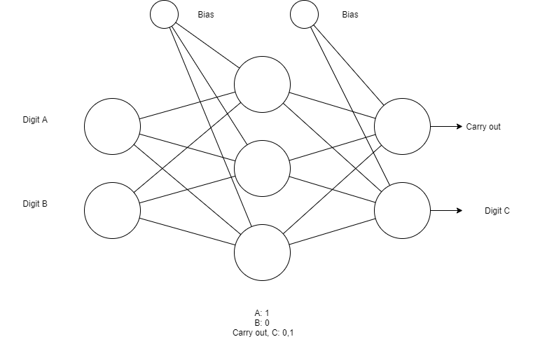
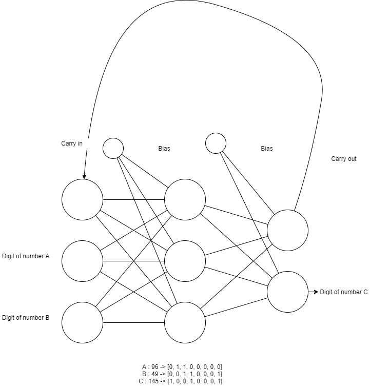

# Artificial Neural Network | Binary Addition

## Half Adder Structure 

### Train Dataset
|Digit A|Digit B|Carry Out|Digit C|
|-|-|-|-|
|0|0|0|0|
|0|1|0|1|
|1|0|0|1|
|1|1|1|0|  

## Full Adder Structure

## How to train model
|Carry In|Digit A|Digit B|Carry Out|Digit C|
|-|-|-|-|-|
|0|0|0|0|0|
|0|0|1|0|1|
|0|1|0|0|1|
|0|1|1|1|0|
|1|0|0|0|1|
|1|0|1|1|0|
|1|1|0|1|0|
|1|1|1|1|1|

